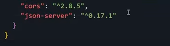

## Despliega JSON Server en Vercel

### Cómo usar (resumen)

1. Clona este repositorio.
2. Actualiza o usa el [`db.json`](./db.json) predeterminado en el repositorio.
3. Regístrate o inicia sesión en [Vercel](https://vercel.com).
4. Desde el panel de Vercel, haz clic en "**+ New Project**" y luego "**Import**" tu repositorio.
5. En la pantalla "**Configure Project**", deja todo como está por defecto y haz clic en "**Deploy**".
6. Espera hasta que el despliegue esté completo, ¡y tu propio servidor JSON estará listo para funcionar!

## `db.json` Predeterminado

```json
{
  "categorias": [
    {
      "id": "1",
      "nombre": "Front End",
      "color": "#6BD1FF"
    },
    {
      "id": "2",
      "nombre": "Back End",
      "color": "#00C86F"
    },
    {
      "id": "3",
      "nombre": "Innovación y gestión",
      "color": "#FFBA05"
    }
  ],
  "videos": [
    {
      "id": "63df",
      "titulo": "Cuando usar let, var y const",
      "imagen": "/img/Fronted/image-2.jpg",
      "categoria": "1",
      "url": "https://www.youtube.com/embed/PztCEdIJITY?si=hfEWd-LVzlUvP_qT",
      "descripcion": "¿A veces cuando estás programando sientes dificultades en saber en qué momento utilizar let, var o const para declarar una variable? En este video te sacamos estas dudas, además de explicarte lo que es escopo global y local en JavaScript."
    },
    {
      "id": "7a6e",
      "titulo": "¿Qué es JavaScript?",
      "categoria": "1",
      "imagen": "/img/Fronted/image-3.jpg",
      "url": "https://www.youtube.com/embed/GJfOSoaXk4s?si=Sy4rvrikw1n4x2-o",
      "descripcion": "JavaScript: ¿qué es y cómo se hizo este lenguaje que genera muchas discusiones y debates entre la gente del área de desarrollo? Genesys y Gabriela nos hablan exactamente de esto en este Alura Tips."
    },
    {
      "id": "95aa",
      "titulo": "Equipo Front End",
      "categoria": "1",
      "imagen": "/img/Fronted/image-4.jpg",
      "url": "https://www.youtube.com/embed/rpvrLaBQwgg?si=V1VLVFRuKgOI_y6-",
      "descripcion": "¿Estás empezando tus estudios de Programación? ¿Te interesa todo lo que es la creación de Páginas Web Desarrollo de Softwares? ¿O estás pensando en cambiar de carrera y entrar a la maravillosa area de tecnología?"
    },
    {
      "id": "6b6a",
      "titulo": "Spring Framework. ¿Qué es ?",
      "imagen": "/img/Backend/image-1.jpg",
      "categoria": "2",
      "url": "https://www.youtube.com/embed/t-iqt1b2qqk?si=HaMciLKuslok023B",
      "descripcion": "¿Busca un framework  para utilizar en sus proyectos? ¿Conoce Spring Framework? Spring es el framework más usado de Java. Nos ofrece herramientas que nos permiten crear proyectos más avanzados, con mejores prácticas y en menor tiempo. También posee una gran comunidad, lo que nos brinda muchísima documentación y ayuda."
    },
    {
      "id": "7b8a",
      "titulo": "¿Qué es SQL y NoSQL?",
      "categoria": "2",
      "imagen": "/img/Backend/image-2.jpg",
      "url": "https://www.youtube.com/embed/cLLKVd5CNLc?si=MYp6WnXXQvqGSPYi",
      "descripcion": "¿Cuáles son las diferencias entre una estructura de datos relacional (SQL) y una no relacional (NoSQL) y cuáles son las principales ventajas de cada una? Álvaro Camacho lo explica en este vídeo."
    },
    {
      "id": "p58a",
      "titulo": "Simplificando tu código en Java: Conoce los enum",
      "categoria": "2",
      "imagen": "/img/Backend/image-3.jpg",
      "url": "https://www.youtube.com/embed/EoPvlE85XAQ?si=jfXKclbzaZEcDm83",
      "descripcion": "¿Escribir muchas variables del tipo constantes en Java te parece un proceso tedioso y que genera muchas líneas de código? En este Alura+ la instructora Génesys Rondón nos enseña a simplificar esta tarea usando un tipo de dato especial llamado enum."
    },
    {
      "id": "f5da",
      "titulo": "¿Qué son las Soft Skills?",
      "imagen": "/img/Innovacion y gestion/image-1.jpg",
      "categoria": "3",
      "url": "https://www.youtube.com/embed/vhwspfvI52k?si=jWQPbz3Ph7gX03Zb",
      "descripcion": "¿Qué son las Softskills y por qué es tan importante desarrollarlas para posicionarse en el mercado laboral? En este video de Alura Tips, Pri Stuani nos habla de las habilidades más buscadas por las empresas en sus profesionales y cómo las Soft Skills te ayudan en el día a día."
    },
    {
      "id": "p3d9",
      "titulo": "7 Soft Skills más deseadas por las empresas",
      "imagen": "/img/Innovacion y gestion/image-2.jpg",
      "categoria": "3",
      "url": "https://www.youtube.com/embed/YhR7Zp8NUzE?si=ky6cHgq598bnyowv",
      "descripcion": "Seguro que ya escuchaste hablar sobre las Soft Skills, pero ¿sabes cuáles son las 7 más buscadas por las empresas? Quédate en este video con nosotros que vamos a explicarte la importancia de estas habilidades y porque son tan requeridas en el mercado laboral."
    }
  ]
}
```

## Créalo por Ti Mismo

### Paso 1

Crea un nuevo repositorio, por ejemplo, **alurageek-API**. Luego clona ese repositorio vacío.

### Paso 2

Necesitas ejecutar el comando `npm init`:

```
npm init -y
```

Esto generará un **package.json**. Ahora, lo que necesitas hacer es cambiar estas líneas:

Cambia esta línea:

```
 "main": "index.js",
```

A esto:

```
  "main": "api/server.js",
```

Y esto:

```
"test": "echo \"Error: no test specified\" && exit 1"
```

A esto:

```
"start": "node api/server.js"
```

### Paso 3

Ahora es el momento de ejecutar el comando:

```
npm install json-server cors
```



Verás que tanto **cors** como **_json-server_** se han agregado al package.json.

### Paso 4

Ejecuta el comando:

```
npm install json-server
```

Agrega el **_.gitignore_** y agrega **_node_modules_**.

### Paso 5

Crea un archivo **_db.json_** y agrega tus propios datos.

Además, necesitarás agregar una nueva [Carpeta llamada **_api_**](./api/) y, dentro de ella, este archivo [**server.js**](./api/server.js):

```javascript
// Ver https://github.com/typicode/json-server#module
const jsonServer = require("json-server");
const server = jsonServer.create();
const router = jsonServer.router("db.json");
const middlewares = jsonServer.defaults();

server.use(middlewares);
// Agrega esto antes de server.use(router)
server.use(
  jsonServer.rewriter({
    "/api/*": "/$1",
    "/producto/:recurso/:id/ver": "/:recurso/:id",
  })
);
server.use(router);
server.listen(3000, () => {
  console.log("El servidor JSON está funcionando");
});

// Exporta la API del Servidor
module.exports = server;
```

### Paso 6

Crea un archivo nuevo llamado [**_vercel.json_**](./vercel.json)

```json
{
  "functions": {
    "api/server.js": {
      "memory": 1024,
      "includeFiles": "db.json"
    }
  },
  "rewrites": [
    {
      "source": "/(.*)",
      "destination": "api/server.js"
    }
  ]
}
```

# No olvides hacer commit y push a tus cambios 🐣

Ve a tu cuenta de Vercel, conecta un nuevo proyecto con tu repositorio y despliega 💙

## Debes tener paciencia

Puede tomar varios minutos para que funcione correctamente. ⏰
